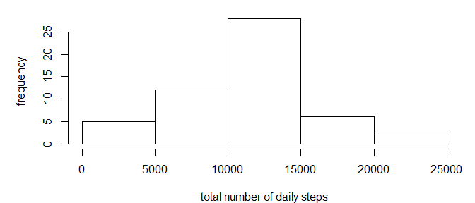
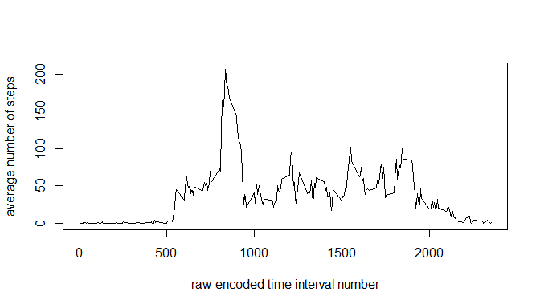
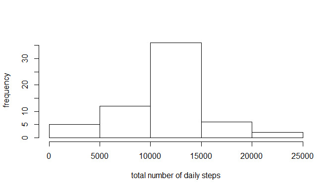
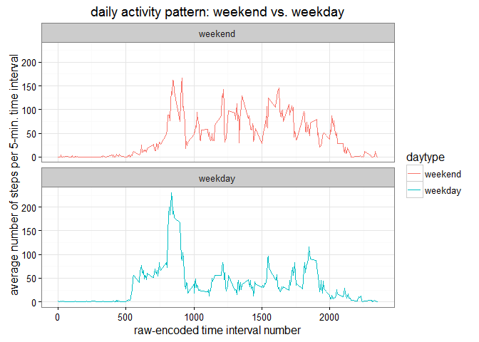

# Reproducible Research: Peer Assessment 1


```r
rm( list = ls() )  ## clears the Environment
```

## Loading and preprocessing the data


```r
unzip( "activity.zip" )
raw <- read.table( "activity.csv", header = TRUE, sep = "," )
daily <- aggregate( steps ~ date, data = raw, FUN = sum )  ## daily aggregates
activ <- aggregate( steps ~ interval, data = raw, FUN = mean )  ## 5-min. ag.
```

## What is mean total number of steps taken per day?


```r
plot.new()
par( mfrow = c( 1, 1), mar = c( 4, 5, 1, 1 ) )
hist( daily$steps, breaks = 5, 
      xlab = "total number of daily steps", ylab = "frequency", main = ""  )
```

<!-- -->

```r
daily.mean <- mean( daily$steps )
daily.median <- median( daily$steps )
```

The **average** number of total steps per day is
**10766.19**.

The **median** of the total number of steps per day is 
**10765**.

## What is the average daily activity pattern?


```r
plot( activ$interval, activ$steps, type = "l" , 
      xlab = "raw-encoded time interval number", 
      ylab = "average number of steps", main = ""  )
```

<!-- -->

```r
mostactiv <- activ$interval[ which.max( activ$steps ) ]
```

The **maximum** number of steps is found on average at 
time interval **835**.

## Imputing missing values


```r
rows_missing <- unique( which( is.na( raw ) ) )  ## indices of rows with missing data
num_missing <- length( rows_missing )  ## number of rows containing missing data
```

The number of rows with **missing values** in the raw data set 
is **2304**.

### Imputation strategy

Use the average daily activity profile to fill-in the missing values:

```r
raw.avg <- rep( activ$steps, length( unique( raw$date ) ) )  ## replicate the average activity profile
raw.imputed <- raw$steps  ## initialization (will be overwritten at missing values)
raw.imputed[ rows_missing ] <- as.integer( round( raw.avg[ rows_missing ] ) )  ## fill-in at missing values
```

### New data set

Use the created *raw.imputed* vector to new data set:

```r
df <- raw
df$steps <- as.integer( round ( raw.imputed ) )  ## preserve integer class of 'steps' column
```

Histogram of the total number of steps taken each day based on imputed data:

```r
df.daily <- aggregate( steps ~ date, data = df, FUN = sum )  ## daily aggregates
hist( df.daily$steps, breaks = 5, 
      xlab = "total number of daily steps", ylab = "frequency", main = ""  )
```

<!-- -->

```r
df.daily.mean <- mean( df.daily$steps )
df.daily.median <- median( df.daily$steps )
```

The **average** number of total steps per day with imputed data is
**10765.64** 
(*versus 10766.19 using the original data*),
which is a difference of 
-0.005%.

The **median** of the total number of steps per day with imputed data is 
**10762**
(*versus 10765 using the original data*),,
which is a difference of 
-0.03%.

Therefore, the **effect** of this method of imputation on the mean and median of the total number of steps per day is **minimal**.

## Are there differences in activity patterns between weekdays and weekends?

Create new factor variable *daytype* in the dataset with two levels -- "weekday" and "weekend":

```r
weekend <- c( "Sat", "Sun" )
dayofweek <- weekdays( strptime( df$date, format = "%Y-%m-%d" ), abbreviate = TRUE )
df$daytype <- "weekday"  ## default initialization
df[ which( dayofweek %in% weekend ), ]$daytype <- "weekend"
df$daytype <- factor( df$daytype )
```

Create separate 5-minute interval aggregates for weekdays and weekends, and combine them into data frame *df.activ*:

```r
wd.activ <- aggregate( steps ~ interval, data = df[ df$daytype == "weekday", ], FUN = mean )
we.activ <- aggregate( steps ~ interval, data = df[ df$daytype == "weekend", ], FUN = mean )
wd.activ$daytype <- as.factor( "weekday" )
we.activ$daytype <- as.factor( "weekend" )
df.activ <- rbind( we.activ, wd.activ )
```

Time series panel plot of average number of steps taken versus 5-minute interval, when averaged across all weekday days or weekend days:

```r
library( ggplot2 )
```

```
## Warning: package 'ggplot2' was built under R version 3.2.5
```

```r
g <- ggplot( df.activ, aes( x = interval, y = steps ) )
g + geom_line( aes( color = daytype ), size = 0.5 ) + 
    facet_wrap( ~ daytype, nrow = 2 ) +
    labs( x = "raw-encoded time interval number" ) + 
    labs( y = "average number of steps per 5-min. time interval" ) +
    labs( title = "daily activity pattern: weekend vs. weekday" ) +
    theme_bw() 
```

<!-- -->

